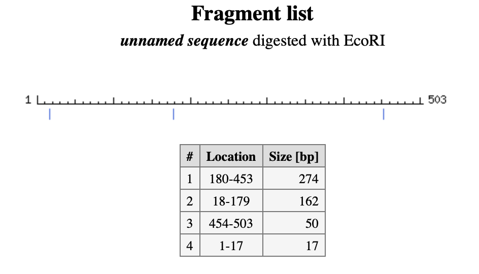
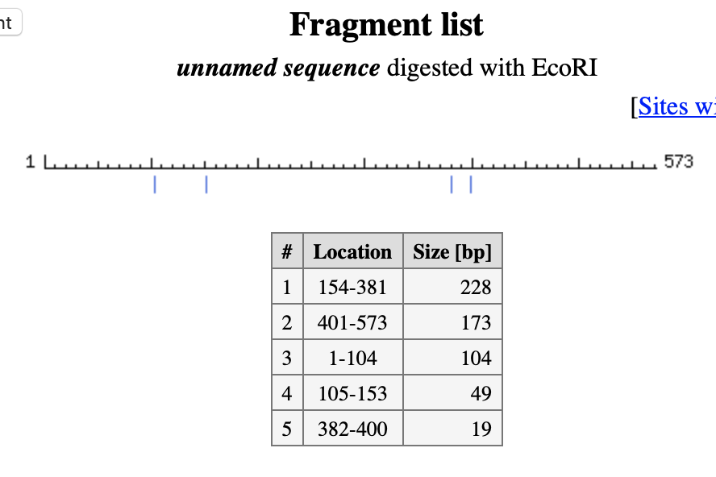
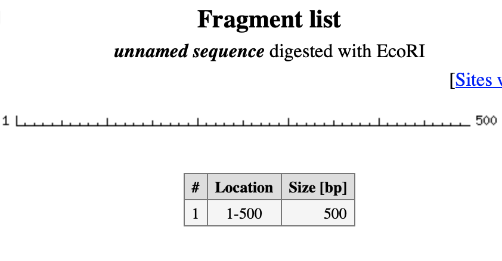

**RE used = ecoRI**

## Dna sequence 1 = 
```
gtggtacgggggtgatgaattctaggtcaaagtagtaattaattattagccaccgacccatagtgactaagagatactatagatcgcatgacgcgtacacagcccaacagaaggcaaatactcatttcggtatctcctaactgctcgtaaggatggtcgagagggataccttcggatagaattcgctttactgacatcttatgcgaccgggcaagttgacggaactgacgacgttatcatacccttagactctaattacacattcttgaaccgagatgactgagtagaagggagctgcatcacgggtgcaattttgacagcgcatacttggccgaaaaatctgttgccgaaaatctatgcggtgcgccaagtagagttatcccttgtcggtctcggttatgtcaggctcgtacgaccgtgatcttcagtcctacactcctcactccgagctggaattctcttgacgacgatcgatatcagatgaccagcgcgcccgtttggca
```

Code's results =

Cleavages = 
```
gtggtacgggggtgatg|aattctaggtcaaagtagtaattaattattagccaccgacccatagtgactaagagatactatagatcgcatgacgcgtacacagcccaacagaaggcaaatactcatttcggtatctcctaactgctcgtaaggatggtcgagagggataccttcggatag|aattcgctttactgacatcttatgcgaccgggcaagttgacggaactgacgacgttatcatacccttagactctaattacacattcttgaaccgagatgactgagtagaagggagctgcatcacgggtgcaattttgacagcgcatacttggccgaaaaatctgttgccgaaaatctatgcggtgcgccaagtagagttatcccttgtcggtctcggttatgtcaggctcgtacgaccgtgatcttcagtcctacactcctcactccgagctgg|aattctcttgacgacgatcgatatcagatgaccagcgcgcccgtttggca
```

indexs of cleavages =
```
fragment 1 starts at 1 and ends at 17.
it's size is 17
fragment 2 starts at 18 and ends at 179.
it's size is 162
fragment 3 starts at 180 and ends at 453.
it's size is 274
fragment 4 starts at 454 and ends at 503.
it's size is 50
```

On using online mapper, we get the following cut sites on the W strands




## Dna sequence 2

```
ttcctttgctcccagcggttccgatgccggggacaccgacatccacgtggccgacagtattactggccgcgacaccgagtgcgtagccagtagtctaggtggcgaattcgttcactcatgagctcaggttccgatccttagcacgccacaaggaattcttaggctcatatcccgggtataggtcctatcaaaagccgttgactcttcaattgaagtgggttgaacgactgggaatcatgcatgccggatcgtcttcgggctgcaagtcacagctaatccgcatatgcaaaaaatgagctttaggcctccattgcttttgtcctagtcttctcgccagcgcgatagatgtatcagcataggagacggctctttagcaagtggaattcctgaggcgtaacagaattcaaaacaaatacagagctgaaatgaacggtgctacaggctgcaggaaagtcctcaattgtttagcctgaaaaaataaattctacagtctgagataaccgctgatctggaaaggatgcgcaagtgtcattactgcttcgatgatcgggttgttcggtaaatctgaatcct
```

code's results =

Cleavages -
```
ttcctttgctcccagcggttccgatgccggggacaccgacatccacgtggccgacagtattactggccgcgacaccgagtgcgtagccagtagtctaggtggcg|aattcgttcactcatgagctcaggttccgatccttagcacgccacaagg|aattcttaggctcatatcccgggtataggtcctatcaaaagccgttgactcttcaattgaagtgggttgaacgactgggaatcatgcatgccggatcgtcttcgggctgcaagtcacagctaatccgcatatgcaaaaaatgagctttaggcctccattgcttttgtcctagtcttctcgccagcgcgatagatgtatcagcataggagacggctctttagcaagtgg|aattcctgaggcgtaacag|aattcaaaacaaatacagagctgaaatgaacggtgctacaggctgcaggaaagtcctcaattgtttagcctgaaaaaataaattctacagtctgagataaccgctgatctggaaaggatgcgcaagtgtcattactgcttcgatgatcgggttgttcggtaaatctgaatcct
```
indexs of cleavages =
```
fragment 1 starts at 1 and ends at 104.
it's size is 104
fragment 2 starts at 105 and ends at 153.
it's size is 49
fragment 3 starts at 154 and ends at 381.
it's size is 228
fragment 4 starts at 382 and ends at 400.
it's size is 19
fragment 5 starts at 401 and ends at 573.
it's size is 173
```

On using online mapper, we get the following cut sites on the W strands




## Dna sequence 3

```
ggtccttgggaagcattaggtcccgtctttgtgtaaatctcatgcgtttggtaagtaatgggcacctcagggctgttcgatctgccgactgtggggtcagttacgtaagccatgggtaccgagaattcggtaaggcagtgattgacagtaaactcgaggcacaaaccgtagtggcattcgacaactgcggatccgattcttttccccagccagtctgtcagaggttgacttccttgtttgcctgccaatcacgtgaaggaagagcgtatagctttttttgctttgtaccgctatgttttggtaccgtatgaagggcccttccaacagaccaagggtagagcaaatcgtcctgtgctaaacgccattgtaatgtttcctcgtagctggaccctttggtcgcagttacgagtactatctaaagcattactttgaactctcatcgccgcgtgcactgacagtccgtacgcgtccgctatgcggactttgcacctctgagtctaagccatacaaatacacatcagcgcgcagaattctacaccatatgaattcgctgagcatctaaagctccgttttcgcctaaccctagagaggcacgcaggttccacatgataattgcctgcttgagaaactcgagctagcattttgacagagcatcaagcttaacgaattgat
```

code's results =

Cleavages -
```
ggtccttgggaagcattaggtcccgtctttgtgtaaatctcatgcgtttggtaagtaatgggcacctcagggctgttcgatctgccgactgtggggtcagttacgtaagccatgggtaccgag|aattcggtaaggcagtgattgacagtaaactcgaggcacaaaccgtagtggcattcgacaactgcggatccgattcttttccccagccagtctgtcagaggttgacttccttgtttgcctgccaatcacgtgaaggaagagcgtatagctttttttgctttgtaccgctatgttttggtaccgtatgaagggcccttccaacagaccaagggtagagcaaatcgtcctgtgctaaacgccattgtaatgtttcctcgtagctggaccctttggtcgcagttacgagtactatctaaagcattactttgaactctcatcgccgcgtgcactgacagtccgtacgcgtccgctatgcggactttgcacctctgagtctaagccatacaaatacacatcagcgcgcag|aattctacaccatatg|aattcgctgagcatctaaagctccgttttcgcctaaccctagagaggcacgcaggttccacatgataattgcctgcttgagaaactcgagctagcattttgacagagcatcaagcttaacgaattgat
```
indexs of cleavages =
```
fragment 1 starts at 1 and ends at 123.
it's size is 123
fragment 2 starts at 124 and ends at 528.
it's size is 405
fragment 3 starts at 529 and ends at 544.
it's size is 16
fragment 4 starts at 545 and ends at 672.
it's size is 128
```

On using online mapper, we get the following cut sites on the W strands


## Dna sequence 4

```
aaccccaaagtcgccagatataccgcgtatccttcccatcccctgcctatcttgacccacttgtactgacgtgcccaagtccatacgccagtacggaacacaagggggcatctcaggctgcaaagcctgcaccgtgagcttcgtagctacgttatgtctaattgaactccagctcatgacctctaacggagttcgtaggacgtggatgaggcgtgaggggccctcgctggaggggttttttggggtacagccaacggcttgtgtcgtgttcgggggtacgcgaactaccctttcgtagctactttgttctctataggtttcataagggttcctggcatcttgaatacgtgtttggagtgcctgcggtcaggcgccgtatgatagtctctcgtactcgttctgagtcaccgctatcagtatcactcctcaataatattttacgctccgttaccaggcatagtccgaactagaggccgcgttaagcgggacctcctaccgcg
```

code's results =

Cleavages -
```
aaccccaaagtcgccagatataccgcgtatccttcccatcccctgcctatcttgacccacttgtactgacgtgcccaagtccatacgccagtacggaacacaagggggcatctcaggctgcaaagcctgcaccgtgagcttcgtagctacgttatgtctaattgaactccagctcatgacctctaacggagttcgtaggacgtggatgaggcgtgaggggccctcgctggaggggttttttggggtacagccaacggcttgtgtcgtgttcgggggtacgcgaactaccctttcgtagctactttgttctctataggtttcataagggttcctggcatcttgaatacgtgtttggagtgcctgcggtcaggcgccgtatgatagtctctcgtactcgttctgagtcaccgctatcagtatcactcctcaataatattttacgctccgttaccaggcatagtccgaactagaggccgcgttaagcgggacctcctaccgcg
```
indexs of cleavages =
```
fragment 1 starts at 1 and ends at 500.
it's size is 500
```

On using online mapper, we get the following cut sites on the W strands

